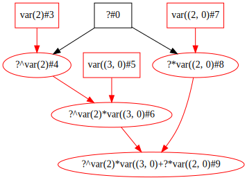
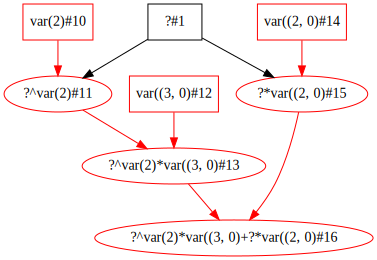
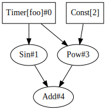

# Lazy Automatic Differentiation 

$f(x) = 3x^2 + 2x$

$f'(x) = 6x + 2$


```python
import tributary.lazy as tl
```


```python
# f = 3x^2 + 2x
# f' = 6x + 2
x1 = tl.Node(value=(5,1), use_dual=True)
x2 = tl.Node(value=(6,1), use_dual=True)
x3 = tl.Node(value=(7,1), use_dual=True)

out1 = tl.Add(tl.Mult(tl.Pow(x1, 2), (3,0)), tl.Mult(x1, (2,0)))
out2 = tl.Add(tl.Mult(tl.Pow(x2, 2), (3,0)), tl.Mult(x2, (2,0)))
out3 = tl.Add(tl.Mult(tl.Pow(x3, 2), (3,0)), tl.Mult(x3, (2,0)))
```


```python
out1.graphviz()
```


    

    


```python
out2.graphviz()
```


    

    


```python
out3.graphviz()
```


    

    


```python
out1()[1]
```


    32


```python
out2()[1]
```


    38


```python
out3()[1]
```


    44


```python
assert [out1()[1], out2()[1], out3()[1]] == [6*x+2 for x in [5, 6, 7]]
```

# Streaming automatic differentiation

$f(x) = sin(x) + x^2$

$f'(x) = cos(x) + 2x$


```python
import tributary.streaming as ts
import asyncio
import math
```


```python
# f = sin(x) + x^2
# f' = cos(x) + 2x

rng = range(-10,11)
def func():
    for _ in rng:
        yield(_,1)

x = ts.Timer(func, count=len(rng), use_dual=True)
out = ts.Add(ts.Sin(x), ts.Pow(x,2))
```


```python
out.graphviz()
```


    

    


```python
result = ts.run(out)
```


```python
while not result.done():
    await asyncio.sleep(1)
```


```python
result.result()
```


    [(100.54402111088937, -20.839071529076453),
     (80.58788151475824, -18.911130261884676),
     (63.01064175337662, -16.145500033808613),
     (48.34301340128121, -13.246097745656696),
     (36.27941549819893, -11.039829713349635),
     (25.95892427466314, -9.716337814536773),
     (16.756802495307927, -8.653643620863612),
     (8.858879991940134, -6.989992496600445),
     (3.090702573174318, -4.416146836547142),
     (0.1585290151921035, -1.4596976941318602),
     (0.0, 1.0),
     (1.8414709848078965, 2.5403023058681398),
     (4.909297426825682, 3.5838531634528574),
     (9.141120008059866, 5.010007503399555),
     (15.243197504692072, 7.346356379136388),
     (24.04107572533686, 10.283662185463227),
     (35.72058450180107, 12.960170286650365),
     (49.65698659871879, 14.753902254343304),
     (64.98935824662338, 15.854499966191387),
     (81.41211848524176, 17.088869738115324),
     (99.45597888911063, 19.160928470923547)]


```python
assert [x[1] for x in result.result()] == [math.cos(_) + 2*_ for _ in rng]
```
