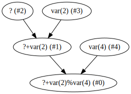
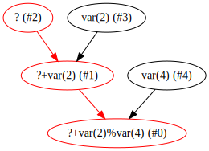
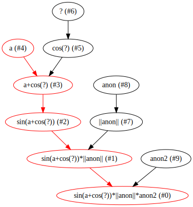
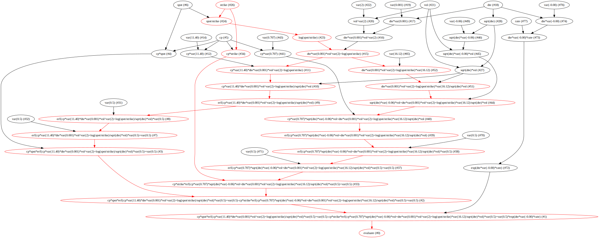

# Simple Example
With tributary we can easily construct a lazily evaluated graph.


```python
import tributary.lazy as tl
```


```python
a = tl.Node(value=5)
b = a + 2
c = b % 4
```

To evaluate the value of the nodes, simply execute them


```python
c()
```


    3


To inspect the dependency graph, we can utilize the `graphviz` method


```python
c.graphviz()
```





If we modify the value of a node, we can see the graph's dirty nodes in red


```python
a.setValue(2)
c.graphviz()
```





c will retain its old value until reexecuted


```python
c.value()
```


    3


```python
c()
```


    0


```python
c.value()
```


    0


# Functions
We can utilize the full library of mathematical functions built into tributary


```python
from random import random
a = tl.Node(name='a', callable=lambda: random(), always_dirty=True) + tl.Cos(a)
b = tl.Sin(a) * tl.Abs(tl.Node(name='anon', value=2))
c = b * tl.Node(name='anon2', value=10)
c()
```


    6.168300449269846


```python
c.graphviz()
```





# Symbolic - Simple Example
Using tributary's sympy functionality, we can construct relatively complicated graphs. Here we will construct as simple lazy graph


```python
import tributary.symbolic as ts
import tributary.lazy as tl

# Parse sympy expression
expr = ts.parse_expression("10sin**2 x**2 + 3xyz + tan theta")

# Generate a new class representing the graph
clz = ts.construct_streaming(expr)


# A function to use as an input
def foo(*args):
    for _ in range(5):
        yield _

# Construct with inputs
x = clz(x=tl.Node(value=1), y=tl.Node(callable=foo), z=tl.Node(value=1), theta=tl.Node(value=4))

# Run the graph
x
```


    <tributary.symbolic.construct_streaming.<locals>.Streaming at 0x11d277490>


# Symbolic - More Complicated Example
Here we will construct a lazy pricer for a vanilla european option


```python
import numpy as np
import sympy as sy
from IPython.display import display, HTML
from sympy.stats import Normal as syNormal, cdf
sy.init_printing()

# adapted from https://gist.github.com/raddy/bd0e977dc8437a4f8276
#spot, strike, vol, days till expiry, interest rate, call or put (1,-1)
spot, strike, vol, dte, rate, cp = sy.symbols('spot strike vol dte rate cp')

T = dte / 260.
N = syNormal('N', 0.0, 1.0)

d1 = (sy.ln(spot / strike) + (0.5 * vol ** 2) * T) / (vol * sy.sqrt(T))
d2 = d1 - vol * sy.sqrt(T)

TimeValueExpr = sy.exp(-rate * T) * (cp * spot * cdf(N)(cp * d1) - cp * strike  * cdf(N)(cp * d2))
```

Let's take a look at the sympy expression


```python
TimeValueExpr
```


$\displaystyle \left(cp spot \left(\frac{\operatorname{erf}{\left(\frac{8.06225774829855 \sqrt{2} cp \left(0.00192307692307692 dte vol^{2} + \log{\left(\frac{spot}{strike} \right)}\right)}{\sqrt{dte} vol} \right)}}{2} + \frac{1}{2}\right) - cp strike \left(\frac{\operatorname{erf}{\left(0.5 \sqrt{2} cp \left(- 0.0620173672946042 \sqrt{dte} vol + \frac{16.1245154965971 \left(0.00192307692307692 dte vol^{2} + \log{\left(\frac{spot}{strike} \right)}\right)}{\sqrt{dte} vol}\right) \right)}}{2} + \frac{1}{2}\right)\right) e^{- 0.00384615384615385 dte rate}$


Now using tributary, we construct a lazily-evaluated graph


```python
import tributary.symbolic as ts
PriceClass = ts.construct_lazy(TimeValueExpr)

price = PriceClass(spot=210.59, strike=205, vol=14.04, dte=4, rate=.2175, cp=-1)

price.evaluate()()  # 124.819

price.strike = 210
price.evaluate()()  # 124.032

price.evaluate().graphviz()

```





If we adjust an input, we can see the nodes that will be recalculated on next evaluation


```python
price.strike = 205
price.evaluate().graphviz()

```


```python

```
