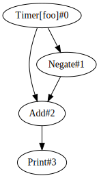
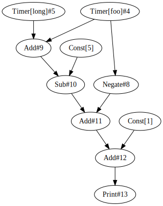
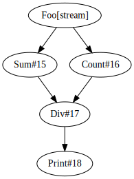
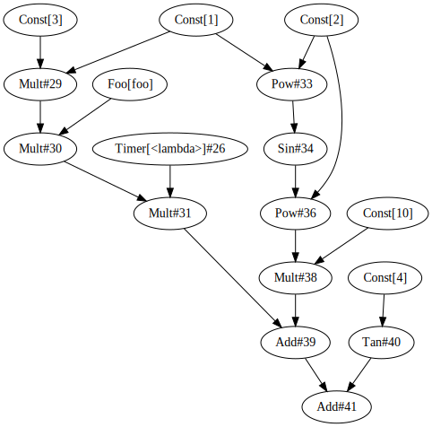
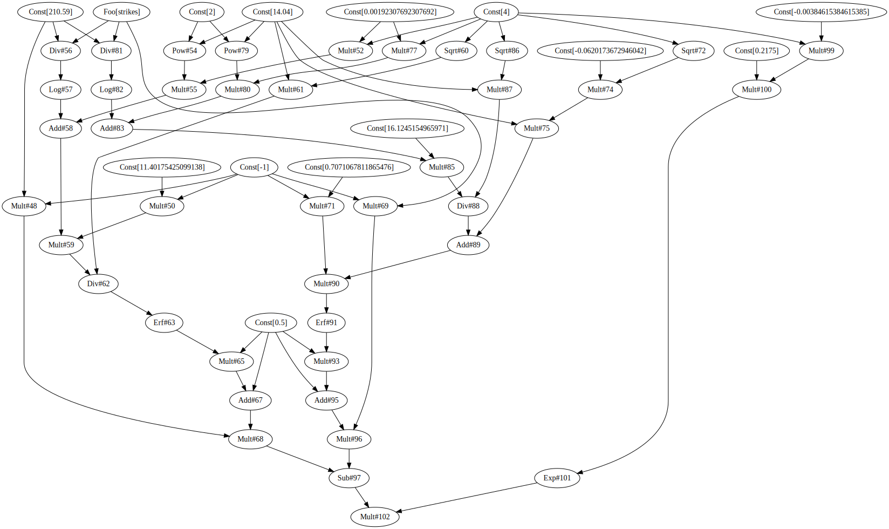

# Simple Example
With tributary we can easily construct a forward-propagating reactive graph


```python
import tributary.streaming as ts
import random, time
```


```python
def foo():
    return random.random()

def long():
    print('long called!')
    time.sleep(1)
    return 5


# A timer calls the given function every interval up to count times
test = ts.Timer(foo, {}, interval=.5, count=5)

test2 = ts.Negate(test)

res2 = test + test2

p2 = ts.Print(res2)
```


```python
ts.GraphViz(p2)
```





```python
x = ts.run(p2)
```

    0.0
    0.0
    0.0
    0.0
    0.0


```python
x.result()
```


    [0.0, 0.0, 0.0, 0.0, 0.0]


# More Complex Example
Let's construct a slightly more complex graph


```python
import asyncio

def foo():
    return random.random()

async def long():
    await asyncio.sleep(1)
    return 5
    
rand = ts.Timer(foo, interval=0, count=5)
five = ts.Timer(long, interval=0, count=5)
one = ts.Const(1)
five2 = ts.Const(5)
neg_rand = ts.Negate(rand)


x1 = rand + five # 5 + rand
x2 = x1 - five2 # rand
x3 = x2 + neg_rand # 0
res = x3 + one # 1

p = ts.Print(res)

```


```python
p.graphviz()
```





```python
x = ts.run(p)
```

    0.9999999999999999
    0.9999999999999999
    0.9999999999999999
    1.0000000000000004
    0.9999999999999998


```python
x.result()
```


    [0.9999999999999999,
     0.9999999999999999,
     0.9999999999999999,
     1.0000000000000004,
     0.9999999999999998]


# Rolling Mean


```python
def stream():
    for _ in range(10):
        yield _

f = ts.Foo(stream)
s = f.rollingSum()
c = f.rollingCount()
f3 = ts.Div(s, c)
p = ts.Print(f3)


```


```python
p.graphviz()
```





```python
x = ts.run(p)
```

    0.0
    0.5
    1.0
    1.5
    2.0
    2.5
    3.0
    3.5
    4.0
    4.5


```python
x.result()
```


    [0.0, 0.5, 1.0, 1.5, 2.0, 2.5, 3.0, 3.5, 4.0, 4.5]


# Custom Calculations and Window Functions


```python
def myfoo(ds):
    for d in ds:
        vals = d.values()
        d['HIGH'] = max(vals)
        d['LOW'] = min(vals)
        d['MID'] = sum(vals)/len(vals)
    avgs = [x['MID'] for x in ds]
    ds[-1]['SMA'] = sum(avgs)/len(avgs)
    return [ds[-1]]
```


```python
vals = ts.Random(100)
w = ts.Window(vals, size=5)
n = ts.Apply(w, myfoo)
psp1 = ts.Perspective(n, schema={'HIGH': float, 'LOW': float, 'MID': float, 'SMA': float}, plugin='y_line')
x = ts.run(ts.Perspective(psp1, schema={'HIGH': float, 'LOW': float, 'MID': float, 'SMA': float}))
# This will only display in the notebook, not on Github
# it uses https://perspective.finos.org/
```


    PerspectiveWidget(columns=['HIGH', 'LOW', 'MID', 'SMA'], plugin='y_line')


    PerspectiveWidget(columns=['HIGH', 'LOW', 'MID', 'SMA'])


# Symbolic - Simple Example
Using tributary's sympy functionality, we can construct relatively complicated graphs. Here we will construct as simple lazy graph


```python
import tributary.symbolic as ts
import tributary.streaming as tss

# Parse sympy expression
expr = ts.parse_expression("10sin**2 x**2 + 3xyz + tan theta")

# Generate a new class representing the graph
clz = ts.construct_streaming(expr)


# A function to use as an input
def foo(*args):
    for _ in range(5):
        yield _

# Construct with inputs
x = clz(x=tss.Const(1), y=tss.Foo(foo), z=tss.Timer(lambda: 1, count=0), theta=tss.Const(4))
```


```python
# View the graph
x.graphviz()
```





```python
# Run the graph
y = x.run()
y
```


    <Task pending coro=<_run() running at /Users/theocean154/Programs/projects/tributary/tributary/examples/tributary/streaming/__init__.py:11>>


```python
y.result()
```


$\displaystyle \left[ 8.23855546508529, \  11.238555465085287, \  14.238555465085287, \  17.238555465085287, \  20.238555465085287\right]$


# Symbolic - More Complicated Example
Here we will construct a streaming pricer for a vanilla european option


```python
import numpy as np
import sympy as sy
from IPython.display import display, HTML
from sympy.stats import Normal as syNormal, cdf
sy.init_printing()

# adapted from https://gist.github.com/raddy/bd0e977dc8437a4f8276
#spot, strike, vol, days till expiry, interest rate, call or put (1,-1)
spot, strike, vol, dte, rate, cp = sy.symbols('spot strike vol dte rate cp')

T = dte / 260.
N = syNormal('N', 0.0, 1.0)

d1 = (sy.ln(spot / strike) + (0.5 * vol ** 2) * T) / (vol * sy.sqrt(T))
d2 = d1 - vol * sy.sqrt(T)

TimeValueExpr = sy.exp(-rate * T) * (cp * spot * cdf(N)(cp * d1) - cp * strike  * cdf(N)(cp * d2))
```


```python
TimeValueExpr
```


$\displaystyle \left(cp spot \left(\frac{\operatorname{erf}{\left(\frac{8.06225774829855 \sqrt{2} cp \left(0.00192307692307692 dte vol^{2} + \log{\left(\frac{spot}{strike} \right)}\right)}{\sqrt{dte} vol} \right)}}{2} + \frac{1}{2}\right) - cp strike \left(\frac{\operatorname{erf}{\left(0.5 \sqrt{2} cp \left(- 0.0620173672946042 \sqrt{dte} vol + \frac{16.1245154965971 \left(0.00192307692307692 dte vol^{2} + \log{\left(\frac{spot}{strike} \right)}\right)}{\sqrt{dte} vol}\right) \right)}}{2} + \frac{1}{2}\right)\right) e^{- 0.00384615384615385 dte rate}$


```python
import tributary.symbolic as ts
PriceClass = ts.construct_streaming(TimeValueExpr)


def strikes():
    strike = 205
    while strike < 220:
        yield strike
        strike += 2.5

price = PriceClass(spot=tss.Const(210.59),
                   strike=tss.Foo(strikes),
                   vol=tss.Const(14.04),
                   dte=tss.Const(4),
                   rate=tss.Const(.2175),
                   cp=tss.Const(-1))

price.graphviz()

```





Our function `strikes` will stream in strike prices, and we will see our price output change accordingly


```python
x = price.run()

```


```python
x.result()
```


$\displaystyle \left[ 124.8198933249367, \  126.82508170405075, \  128.83501237227932, \  130.8496010565144, \  132.86876573965452, \  134.8924265789232\right]$


```python

```
